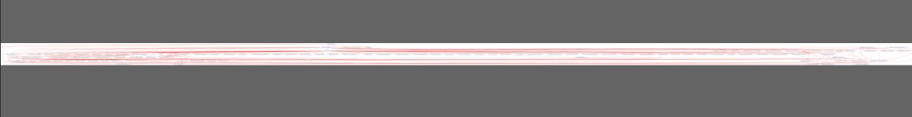

# Webpack Dependency Graph Visualizer

## What is it

 * webpack [stats.json](https://webpack.js.org/api/stats) parser/converter for visual/UI dependencies analysis
 * [configurable](./deps.config.ts) filters: exclude, except, include, max deps count
 * output formats:
    * [graphml](http://graphml.graphdrawing.org/) graph for proprietary [yed](https://www.yworks.com/products/yed/download) editor
    * [DOT](https://github.com/glejeune/node-graphviz) graph
    * `*.png` [cytoscape](https://cytoscape.org/) graph export
    * json debug data

## What is it for

 * Refactoring decision making helper
 * addition tool for the [code analysis methodic](https://github.com/bskydive/code_quality_js)
 * Detect a circular dependency in a large monorepo project.
 * Figure out where the module is being used, imported and exported from.
 * Analyze why webpack cannot tree-shake a particular module or dependency from the chunk.

## How to run

 * set the [config](./deps.config.js) params
 * optionally use [node version manager](https://github.com/nvm-sh/nvm) to choose node@16+
 * execute in console
    ```bash
        nvm i 16 # optionally
        npm i
        cp ${your_project_folder}/stats.json ./webpack-dep-graph/webpack-stats.json
        npm run start
        
    ```

## Caveats

 * terminology:
    * webpack `module`: dependencies, source in graph
	* webpack `reason(origin)`: consumer, destination in graph
    * `module` == `node`
 * dependency map calculated only for nodes with dependencies. For the dot format it's ok, but for the graphml bunch of nodes added from the dependencies array
 * see the full path in node data properties(right click)
    * 
 * search in nodes, urls, properties
    * 
 * Exporting one dependency in multiple files can be confusing
    * 
    * 
 * Graph node label consist of file name only, so if you see similar names, you can right-click it and check the properties-->data tab to see the full path
    * 
    * 
    * 
 * You can enable edge labeling and coloring to check similar dependencies origins
    * 
    * 

## Examples

Generating graphml and editing it in [yEd](https://www.yworks.com/products/yed/download) are the best option for now. Best yEd layouts: circular(alt+shift+c), hierarchical(alt+shift+h).

The graphviz layout renderer seems to be less useful. You can upload the simplified dot file into any [graphviz editor](http://magjac.com/graphviz-visual-editor/) and try to play with settings.

 * input
    * example of the [webpack stats](./doc/webpack-stats.zip)
 * output webpackV5
    * run `npm run webpack`
    * [summary](./doc/stats_summary.json)
    * [deps.config.ts](./deps.config.ts)
        ```ts
            input: {
                webpackStatsFileName: "stats.json",
            },
            filters: {
                exclude: [
                    "node_modules",
                    "deps.config",
                    "files",
                    "logger"
                ],
        ```
    * [json: circular dependencies](./doc/webpackV5/circular.json)
        * 
    * [json: cytoscape](./doc/webpackV5/cytoscape.json)
    * [json: analyzed deps from webpack stats](./doc/webpackV5/deps.json)
    * [xml: simplified dot graph](./doc/webpackV5/graph_simplified.dot)
        * 
 * output webpackV3
    * [summary](./doc/stats_summary.json)
    * [deps.config.ts](./deps.config.ts)
        ```ts
            exclude: ["cache", "webpack", "node_modules", 'main', 'logger', 'index', 'profile', 'config', 'platform','settings', 'popup', 'app', 'confirm', 'analytics', 'theme', 'error', 'home'],
            excludeExcept: [], includeOnly: [],
        ```
    * [json: circular dependencies](./graph-output/circular.json)
    * [json: cytoscape](./graph-output/cytoscape.json)
    * [json: analyzed deps from webpack stats](./graph-output/deps.json)
    * [xml: simplified dot graph](./graph-output/graph_simplified.dot)
        * 

### graphviz

* [xml: dot](./graph-output/graphviz.dot)
    * 
* [png: dot layout](./graph-output/graphviz_dot.png)
    * 
    * 
* [png: spring layout](./graph-output/graphviz_spring.png)
    * 
* [png: directed layout](./graph-output/graphviz_directed.png)
    * 
    * 
* [png: circular layout](./graph-output/graphviz_circular.png)
    * 
    * 
* [png: radial layout](./graph-output/graphviz_radial.png)
    * 
* [png: clustered layout](./graph-output/graphviz_clustered.png)
    * 

### graphml

Used for [yed](https://www.yworks.com/products/yed) editor

 * [graphml: raw xml](./graph-output/deps.graphml)
 * Manually applied in yed circular layout: `tools-->fit node to label`, `layout-->circular (alt+shift+c)`

 * exclude most frequently used dependencies
    * [filters](./deps.config.ts):
    ```ts
		exclude: ["index", "node_modules", "main", "cache", "webpack", "logger", "profile", "config", "platform", "settings", "popup", "confirm", "analytics", "theme", "error",],
		excludeExcept: [], includeOnlyDestNode: [], includeOnlySrcNode: [],
		edgeTypeExclude: ["cjs self exports reference","export imported specifier",],
    ```
    * summary: imports: 594; dependencies: 123 nodesPaths: 166 nodes: 168
    * [graphml](./graph-output/deps_circular.graphml)
    * 
 * include all
    * [deps.config.ts](./deps.config.ts)
        ```ts
            exclude: [], excludeExcept: [],
            includeOnlyDestNode: [""], includeOnlySrcNode: [""],
		    edgeTypeExclude: ["cjs self exports reference","export imported specifier"],
        ```
    * summary: imports: 8623; dependencies: 1630 nodesPaths: 2019 nodes: 2021
    * 
 * who use `@angular/forms` dependencies: exclude `node_nodules` except `angular` and include only `forms` source modules
    * [filters](./deps.config.ts):
        ```ts
            filters: {
                exclude: ["node_modules"],
                excludeExcept: ["angular"], includeOnlyDestNode: ["key.ts"], includeOnlySrcNode: ["key.ts"],
            //...
            graphml: {
                showSourceEdgeLabels: false,
                showDestEdgeLabels: true,
        ```
    * 
 * exclude non project files
    * summary: imports: 1654; dependencies: 195 nodesPaths: 224 nodes: 226
    * [deps.config.ts](./deps.config.ts)
        ```ts
            exclude: ['cache', 'webpack', 'node_modules'],
            excludeExcept: [], includeOnly: [],
        ```


## Similar projects

 * deps graph with [npm](https://www.npmjs.com/package/dependency-cruiser) and [vscode](https://marketplace.visualstudio.com/items?itemName=juanallo.vscode-dependency-cruiser) plugin
 * deps diff with query language [statoscope](https://statoscope.tech/)
 * without webpack stats.json [repo](https://github.com/pahen/madge)
 * forked from: unmaintained broken draft [repo](https://github.com/heypoom/webpack-dep-graph)
 * Unmaintained [repo](https://github.com/g0t4/webpack-stats-graph)
 * Unmaintained [repo](https://github.com/jantimon/webpack-dependency-stats)

## TODO

 * v1.4.0
    * depsCountColoring
    * circular detection draft
    * collapseNodePaths=[] option to simplify DI/Router/Libs deps view
    * coupling/cohesion graph
        * edge color: import count
        * node size: lines count
        * node color: code complexity
 * v1.5.0
    * circular detection
    * add gephi examples
    * validate/refactor examples
 * v2
    * migrate to new repo
    * npm package
 * v3
    * webpack plugin
 * v4
    * vscode plugin(folder/file right click) like in dependency cruiser
        * stats.json validation with current folder structure
        * collect stats.json before run
 * v5+
    * replace UUID by relative path
    * fix circular.json comparing to eslint
    * add issuedPath
    * use xml schema for graphml parser
        * http://www.w3.org/2001/XMLSchema-instance
        * http://graphml.graphdrawing.org/xmlns 
        * http://www.yworks.com/xml/schema/graphml/1.1/ygraphml.xsd
        * http://www.yworks.com/xml/yfiles-common/1.0/java
        * http://www.yworks.com/xml/yfiles-common/markup/primitives/2.0
        * http://www.yworks.com/xml/yfiles-common/markup/2.0
        * http://www.yworks.com/xml/graphml
        * http://www.yworks.com/xml/yed/3
    * local webpack dev server
    * deps size in UI
    * deps size in stats_summary.json
    * local web [graphviz](http://magjac.com/graphviz-visual-editor/) graph viewer
    * local web [cytoscape](https://js.cytoscape.org) graph viewer
