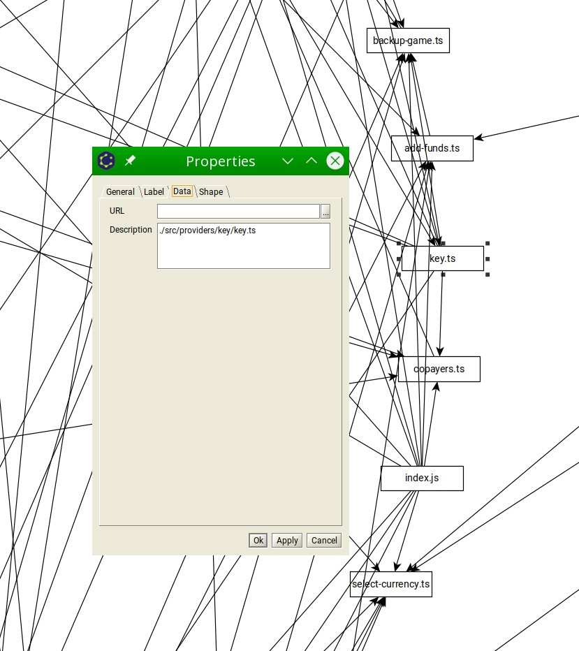

# Webpack Dependency Graph Visualizer

Fixed and working.

## What is it

 * webpack [stats.json](https://webpack.js.org/api/stats) parser/converter for visual/UI dependencies analysis
 * [configurable](./deps.config.ts) deps filters: exclude, except, include
 * output formats:
    * [graphml](http://graphml.graphdrawing.org/) graph for proprietary [yed](https://www.yworks.com/products/yed/download) editor
    * [DOT](https://github.com/glejeune/node-graphviz) graph
    * `*.png` [cytoscape](https://cytoscape.org/) graph export
    * json debug data

## TODO

 * add excludeNodeByMaxDepsCount
 * fix circular.json comparing to eslint

 * use xml schema for graphml parser
    * http://www.w3.org/2001/XMLSchema-instance
    * http://graphml.graphdrawing.org/xmlns 
    * http://www.yworks.com/xml/schema/graphml/1.1/ygraphml.xsd
    * http://www.yworks.com/xml/yfiles-common/1.0/java
    * http://www.yworks.com/xml/yfiles-common/markup/primitives/2.0
    * http://www.yworks.com/xml/yfiles-common/markup/2.0
    * http://www.yworks.com/xml/graphml
    * http://www.yworks.com/xml/yed/3
 * local webpack dev server
 * local web [graphviz](http://magjac.com/graphviz-visual-editor/) graph viewer
 * local web [cytoscape](https://js.cytoscape.org) graph viewer
 * file size viewer

## Caveats

 * Exporting one dependency in multiple files can be confusing
    * 
    * 
 * Graph node label consist of file name only, so if you see similar names, you can right-click it and check the properties-->data tab to see the full path
    * 
    * 
    * 
 * You can enable edge labeling and coloring to check similar dependencies origins
    * 
    * 

## Examples

Generating graphml and editing it in [yEd](https://www.yworks.com/products/yed/download) are the best option for now. Best yEd layouts: circular(alt+shift+c), hierarchical(alt+shift+h).

The graphviz layout renderer seems to be less useful. You can upload the simplified dot file into any [graphviz editor](http://magjac.com/graphviz-visual-editor/) and try to play with settings.

 * input
    * example of the [webpack stats](./doc/webpack-stats.zip)
 * output webpackV5
    * imports: 15; re-exports: 28; issuers: 43; dependencies: 8
    * [json: circular dependencies](./graph-output/webpackV5/circular.json)
    * [json: cytoscape](./graph-output/webpackV5/cytoscape.json)
    * [json: analyzed deps from webpack stats](./graph-output/webpackV5/deps.json)
    * [xml: simplified dot graph](./graph-output/webpackV5/graph_simplified.dot)
        * 
 * output webpackV3
    * imports: 511; re-exports: 0; issuers: 494; dependencies: 114dependencies: 195
    * [deps.config.ts](./deps.config.ts)
        ```ts
            exclude: ["cache", "webpack", "node_modules", 'main', 'logger', 'index', 'profile', 'config', 'platform','settings', 'popup', 'app', 'confirm', 'analytics', 'theme', 'error', 'home'],
            excludeExcept: [], includeOnly: [],
        ```
    * [json: circular dependencies](./graph-output/circular.json)
    * [json: cytoscape](./graph-output/cytoscape.json)
    * [json: analyzed deps from webpack stats](./graph-output/deps.json)
    * [xml: simplified dot graph](./graph-output/graph_simplified.dot)
        * 
    * graphviz
        * [xml: dot](./graph-output/graphviz.dot)
            * 
        * [png: dot layout](./graph-output/graphviz_dot.png)
            * 
        * [png: spring layout](./graph-output/graphviz_spring.png)
            * 
        * [png: directed layout](./graph-output/graphviz_directed.png)
            * 
            * 
        * [png: circular layout](./graph-output/graphviz_circular.png)
            * 
            * 
        * [png: radial layout](./graph-output/graphviz_radial.png)
            * 
        * [png: clustered layout](./graph-output/graphviz_clustered.png)
            * 
    * graphml for [yed](https://www.yworks.com/products/yed) editor
        * see full in node data properties(right click)
            * 
        * search in nodes, urls, properties
            * 
        * [graphml: raw xml](./graph-output/deps.graphml)
        * Manually applied in yed circular layout: `tools-->fit node to label`, `layout-->circular (alt+shift+c)`
            * exclude non project files
                * summary: imports: 1551, re-exports: 0, issuers: 1252
                * [deps.config.ts](./deps.config.ts)
                    ```ts
                        exclude: ['cache', 'webpack', 'node_modules'],
                        excludeExcept: [], includeOnly: [],
                    ```
                * [graphml](./graph-output/deps_circular.graphml)
                * 
                * 
            * include all
                * summary: imports: 7800; re-exports: 0; issuers: 7493; dependencies: 1630
                * [deps.config.ts](./deps.config.ts)
                    ```ts
                        exclude: [], excludeExcept: [], includeOnly: [],
                    ```
                * 
            * include only angular
                * summary: imports: 64, re-exports: 0, issuers: 52
                * [deps.config.ts](./deps.config.ts)
                    ```ts
                        exclude: ['cache', 'webpack', 'node_modules'],
                        excludeExcept: [], includeOnly: ['angular'],
                    ```
                * 
            * exclude non project files except angular
                * summary: imports: 2025; re-exports: 0; issuers: 1678; dependencies: 237
                * [deps.config.ts](./deps.config.ts)
                    ```ts
                        exclude: ['cache', 'webpack', 'node_modules'],
                        excludeExcept: ['angular'], includeOnly: [],
                    ```
                * 


## What is it for

 * Refactoring decision making helper
 * addition tool for the [code analysis methodic](https://github.com/bskydive/code_quality_js)
 * Detect a circular dependency in a large monorepo project.
 * Figure out where the module is being used, imported and exported from.
 * Analyze why webpack cannot tree-shake a particular module or dependency from the chunk.

## How to run

 * set the [config](./deps.config.js) params
 * optionally use [node version manager](https://github.com/nvm-sh/nvm) to choose node@16+
 * execute in console
    ```bash
        nvm i 16 # optionally
        npm i
        cp ${your_project_folder}/stats.json ./webpack-dep-graph/webpack-stats.json
        npm run start
        
    ```

## this project is based on 

 * unmaintained broken draft repo - https://github.com/heypoom/webpack-dep-graph
 * Maintained, does not use webpack stats.json - https://github.com/pahen/madge
 * Unmaintained - https://github.com/g0t4/webpack-stats-graph
 * Unmaintained - https://github.com/jantimon/webpack-dependency-stats

