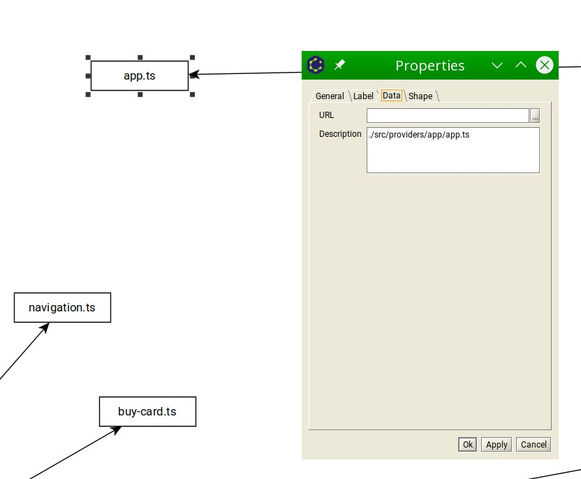

# Documentation

Here you can see some examples of input and output

 * input
    * [webpack-stats](./webpack-stats.json)
 * output
    * [json: circular dependencies](./circular.json)
    * [json: cytoscape](./cytoscape.json)
    * [json: analyzed deps from webpack stats](./deps.json)
    * dot format
        * [dot: simplified dot graph](./graph_simplified.dot)
        * [dot: rendered dot graph](./graph.dot)
        * [png: rendered dot graph](./graph.png)
    * analyzed deps from webpack stats for [yed](https://www.yworks.com/products/yed) editor
        * see full in node data properties(right click)
        * 
        * [graphml: raw](./deps.graphml)
        * [graphml: circular layout(alt+shift+c)](./deps_circular.graphml)
        * [png: circular layout(alt+shift+c)](./deps_circular.png)
